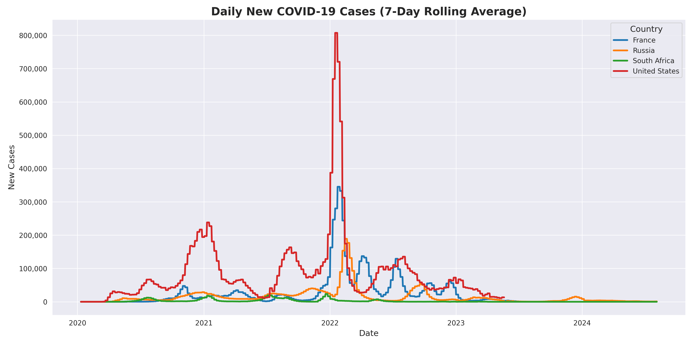

# 🦠 COVID-19 Automated Data Pipeline


## 📄 Overview

This project is an automated data visualization tool designed to track COVID-19 infection trends across multiple strategic countries. 

It implements an **ETL pipeline** that connects directly to the **Our World in Data (OWID)** live repository, processes raw time-series data, and applies a **7-day rolling average algorithm** to smooth out daily reporting noise (e.g., weekend reporting lags).

## 🌍 Scope

The analysis focuses on a comparative study of infection rates in:
* 🇫🇷 **France**
* 🇺🇸 **United States**
* 🇷🇺 **Russia**
* 🇿🇦 **South Africa**

## ⚙️ Technical Highlights

* **Automated Data Fetching:** The script pulls live data from the remote source every time it runs, ensuring real-time analysis.
* **Memory Optimization:** Uses `usecols` during CSV parsing to reduce memory footprint by loading only relevant features.
* **Data Smoothing:** Implementation of a rolling window transformation to normalize data volatility.
* **Professional Visualization:** High-contrast plotting with Seaborn and formatted numeric axes.

## 🚀 How to Run

1.  **Install dependencies:**
    ```bash
    pip install -r requirements.txt
    ```

2.  **Run the notebook:**
    Launch `covid_analysis.ipynb` in Jupyter or VS Code.

## 📊 Sample Output



---
*Data Source: [Our World in Data GitHub](https://github.com/owid/covid-19-data)*